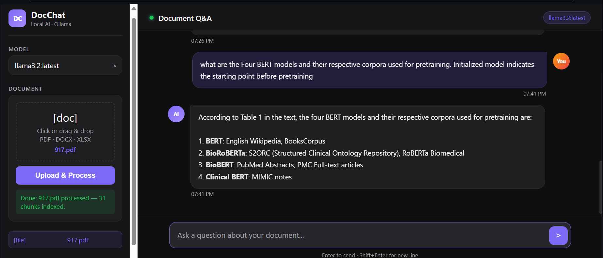

# DocChat — Conversational Chatbot with Any Files

> **Experiment 5** — AI Lab | Local LLM-powered document Q&A using Ollama + LangChain + Flask

---

## Overview

DocChat is a fully **local**, privacy-first conversational chatbot that lets you upload a document and have a natural-language conversation about its contents. No API keys, no cloud — everything runs on your machine via [Ollama](https://ollama.com).



Key capabilities:
- Upload **PDF, Word (DOCX), or Excel (XLSX)** files
- Automatically chunks, embeds, and indexes the document
- Ask questions in a **ChatGPT-style** streaming interface
- Choose any locally installed **Ollama LLM** from a dropdown
- Maintains short **conversation history** across follow-up questions

---

## Architecture

```
┌─────────────────────────────────────────────────────────┐
│                     Browser (index.html)                │
│  ┌──────────────┐   ┌────────────────────────────────┐  │
│  │  Sidebar     │   │  Chat Interface (SSE streaming)│  │
│  │  - Model     │   │  - User messages               │  │
│  │    dropdown  │   │  - AI responses (token-by-     │  │
│  │  - File      │   │    token streaming)            │  │
│  │    upload    │   │  - Typing animation            │  │
│  └──────┬───────┘   └──────────────┬─────────────────┘  │
└─────────┼────────────────────────┬─┘                    │
          │ POST /upload           │ POST /chat/stream     │
          ▼                        ▼
┌─────────────────────────────────────────────────────────┐
│                  Flask Backend (app.py)                 │
│                                                         │
│  ┌──────────────────────┐  ┌──────────────────────────┐ │
│  │   Document Ingestion │  │   RAG Chat Pipeline      │ │
│  │                      │  │                          │ │
│  │  PyPDFLoader         │  │  similarity_search(k=3)  │ │
│  │  Docx2txtLoader      │  │  → inject context into   │ │
│  │  pandas (Excel)      │  │    system prompt         │ │
│  │       ↓              │  │  → stream response via   │ │
│  │  RecursiveText       │  │    Ollama /api/chat       │ │
│  │  Splitter            │  │  → SSE to browser        │ │
│  │  (1500 / 100)        │  └──────────────────────────┘ │
│  │       ↓              │                               │
│  │  ParallelOllama      │                               │
│  │  Embeddings          │                               │
│  │  (6 threads)         │                               │
│  │       ↓              │                               │
│  │  ChromaDB            │                               │
│  │  (in-memory)         │                               │
│  └──────────────────────┘                               │
└─────────────────────────────────────────────────────────┘
          │                        │
          ▼                        ▼
┌─────────────────────────────────────────────────────────┐
│              Ollama  (localhost:11434)                  │
│                                                         │
│   nomic-embed-text   │   llama3 / gemma / llama3.2 …   │
│   (embeddings)       │   (chat completion)             │
└─────────────────────────────────────────────────────────┘
```

---

## Tech Stack

| Layer | Technology |
|---|---|
| Backend | Python 3.11+, Flask |
| LLM Runtime | [Ollama](https://ollama.com) (local) |
| Embeddings | `nomic-embed-text` via Ollama |
| Vector Store | ChromaDB (in-memory) |
| NLP / RAG | LangChain, LangChain-Community |
| Document Loaders | PyPDF, Docx2txt, Pandas |
| Frontend | Vanilla HTML/CSS/JS (dark theme) |

---

## Prerequisites

### 1. Install Ollama
Download from [https://ollama.com/download](https://ollama.com/download) and start the service.

### 2. Pull required models
```bash
# Embedding model (required)
ollama pull nomic-embed-text

# At least one chat model (choose any)
ollama pull llama3
ollama pull llama3.2
ollama pull gemma3:4b
```

### 3. Python 3.11 or 3.12 recommended
> ⚠️ Python 3.13 has known build issues with some scientific packages. Use 3.11 or 3.12.

---

## Installation

```bash
# Clone / navigate to project
cd "AD Lab/CHATBOT"

# Create virtual environment
python -m venv .venv

# Activate (Windows)
.venv\Scripts\activate

# Install dependencies
pip install flask werkzeug pandas \
    langchain langchain-community langchain-core langchain-text-splitters \
    langchain-google-genai langchain-groq \
    chromadb pypdf docx2txt openpyxl \
    psutil requests
```

---

## Running the App

```bash
# Make sure Ollama is running first
ollama serve   # (skip if already running as a background service)

# Start Flask server
python app.py
```

Then open **http://localhost:5000** in your browser.

---

## Usage

1. **Select a model** from the dropdown in the sidebar (auto-populated from Ollama).
2. **Upload a document** — drag & drop or click to browse. Supported formats:
   - `.pdf` — PDF documents
   - `.docx` / `.doc` — Word documents
   - `.xlsx` / `.xls` — Excel spreadsheets
3. Click **Upload & Process** and wait for indexing to complete.
4. **Type your question** in the chat box and press Enter.
5. The AI will answer based solely on the document content, streaming tokens in real time.
6. Use **Clear Conversation** to reset chat history (document index is preserved).

---

## Project Structure

```
CHATBOT/
├── app.py                        # Flask backend — ingestion + RAG + streaming
├── uploads/
│   ├── templates/
│   │   └── index.html            # Single-page chat UI
│   └── <uploaded files>          # Temporarily stored during processing
└── .venv/                        # Python virtual environment
```

---

## API Endpoints

| Method | Endpoint | Description |
|---|---|---|
| `GET` | `/` | Serve the chat UI |
| `GET` | `/models` | List available Ollama models |
| `POST` | `/upload` | Upload & index a document |
| `POST` | `/chat/stream` | SSE streaming chat (RAG) |
| `POST` | `/chat/clear` | Clear conversation history |

### `/upload` — Request
```
Content-Type: multipart/form-data
Body: file=<document>
```

### `/chat/stream` — Request
```json
{
  "query": "What is the main topic of this document?",
  "model": "llama3.2"
}
```

### `/chat/stream` — Response (Server-Sent Events)
```
data: {"token": "The "}
data: {"token": "main "}
data: {"token": "topic..."}
data: {"done": true}
```

---

## Performance Optimizations

| Optimization | Detail |
|---|---|
| **Parallel embeddings** | `ParallelOllamaEmbeddings` runs up to 6 concurrent embed requests instead of sequential, reducing ingestion time proportionally to chunk count |
| **Larger chunks** | `chunk_size=1500` (vs 1000) produces fewer chunks → fewer embed calls total |
| **Smaller overlap** | `chunk_overlap=100` (vs 200) reduces redundant data |
| **CPU thread tuning** | `num_thread` passed to Ollama = all available cores (up to 8) |
| **Tight context window** | `num_ctx=2048` — fits 3 retrieved chunks + history with less memory overhead |
| **Short history** | Only last 4 messages (2 exchanges) kept in prompt |
| **Low temperature** | `temperature=0.2` reduces sampling computation |

---

## Configuration

Key constants at the top of `app.py`:

```python
OLLAMA_BASE_URL = "http://localhost:11434"   # Change if Ollama runs elsewhere
OLLAMA_THREADS  = min(os.cpu_count(), 8)     # CPU threads for LLM inference
EMBED_WORKERS   = min(os.cpu_count(), 6)     # Parallel embedding threads
```

Inside `chat_stream()`:
```python
ollama_options = {
    "num_thread":  OLLAMA_THREADS,
    "num_ctx":     2048,     # increase for very long documents
    "temperature": 0.2,      # 0 = deterministic, 1 = creative
}
```

---

## Troubleshooting

| Issue | Fix |
|---|---|
| `Connection refused` on upload | Ensure Ollama is running: `ollama serve` |
| No models in dropdown | Pull a model: `ollama pull llama3` |
| `nomic-embed-text` error | `ollama pull nomic-embed-text` |
| Slow first response | First inference loads the model into RAM — subsequent queries are faster |
| Excel file not parsed | Ensure `openpyxl` is installed: `pip install openpyxl` |

---

## License

For academic/lab use — Experiment 5, AI Lab.
